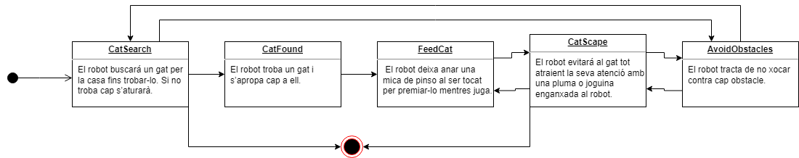

# CatEscape
Robot autònom amb 3 rodes que amb 3 sensors de proximitat i una càmera és capaç de detectar un gat i allunyar-se'n sense xocar-se amb els obstacles.
## taula de continguts
* [Descripció](#Descripció)
* [Requeriments](#Requeriments)
* [Contribucions sorprenents](#Contribucions_sorprenents)
* [Esquema maquinari](#Esquema_maquinari)
* [Peces 3D](#Peces_3D)
* [Arquitectura Programari](#Arquitectura_Programari)
* [Algorismes](#Algorismes)
* [Experiments realitzats](#Experiments_realitzats)
* [Autors](#Autors)

## Descripció
La joguina per gats CatEscape buscarà gats a la teva casa per tal de poder entretenir-los mitjançant una càmera i un algoritme de visió per computador. Quan detecti al gat començarà a escapar i, a través d'un plomissol o joguina, cridarem la seva atenció. Quan es consideri que el gat ha tocat el bot un número de vegades suficients o si ha seguit el robot un temps suficient, aquest deixarà anar pinso per tal de premiar al gat.

El robot també comptarà amb 3 sensors de proximitat per tal de poder esquivar els obstacles que trobi en el seu camí, i amb les rodes podrà girar sense cap problema cap a qualsevol direcció.

## Requeriments
* [Python3.11.x](https://www.python.org)
* [Opencv](https://opencv.org/) 
## Contribucions sorprenents
* Proporciona entreteniment i activitat física: Els gats són animals actius per naturalesa i necessiten estimulació i exercici per mantenir-se sans i feliços.        CatEscape proporciona una forma divertida i emocionant per als gats de jugar i mantenir-se actius, la qual cosa pot millorar el seu benestar general.
* Fomenta la interacció entre propietari i mascota: Jugar amb els gats és una excel·lent manera de desenvolupar i reforçar el llaç entre el propietari i la mascota. CatEscape pot ser una eina per ajudar els propietaris a interactuar amb els seus gats i gaudir de moments divertits junts.
* Promou l'alimentació saludable: La funció de dispensar aliments de CatEscape pot ser una forma útil per assegurar que els gats rebin la quantitat adequada d'aliment i que mengin més lentament, la qual cosa pot ser beneficiós per a la seva digestió.
* Serà probablement l'únic del curs que interactua amb un ésser que no és una persona, a la vegada que interactua amb l'entorn.
* Innovació en joguines per a mascotes: CatEscape és una joguina innovadora que combina diverses funcions en un sol dispositiu, la qual cosa pot ser un avantatge competitiu en el mercat de joguines per a mascotes.
* Fomenta la creativitat: El disseny i la fabricació de CatEscape requereixen habilitats i coneixements tècnics, la qual cosa ens permet fomentar la nostra creativitat i ampliar els nostres coneixements en el desenvolupament d'un robot apte per a mascotes.

## Esquema maquinari
A continuació es mostren els diferents components que compta el robot acompanyat de l'esquema del maquinari:
* 3x Sensors de distància/ultrasò.
* 2x Rodes per moure el robot.
* 1x Raspberry pi zero.
* 1x Sensor capacitiu.
* 1x Controlador de motors.
* 1x Servomotor per la comporta del pinso.
* 1x Porta piles amb 6 piles.
* 1x Càmera 8 MB Raspberry PI.
* 2x Motor micro metall.
* 1x Roda de transferència.
* 1x Placa de proves. 

## Peces 3D
Per la creació del CatEscape, s'han hagut d'imprimir una sèrie de components 3d. Aquestes peces 3d s'han imprès a l'Open Lab de la Universitat Autònoma de Barcelona (UAB).
S'ha utilitzat el programa [onshape](https://cad.onshape.com/) pel disseny de tots els diversos components i [DevoVision](https://www.3devo.com/devovision/download) per la configuració dels dissenys 3d de la base i la part superior en l'extrusora.

Les dues primeres peces impreses són les parts principals del robot, ja que formen la base i la part superior del robot per poder suportar els diferents components d'aquest. A la base se li ha retallat dos rectangles de la part lateral per tal que hi puguin cabre les rodes, i quatre orificis per poder subjectar la part d'avall amb la de dalt. En la part superior se li han realitzat dos rectangles, un per encabir el switch activador del robot, i l'altre per tal que hi passi el cable de la cámera cap a la Raspberri. 

Amb les impressores 3d s'han imprès els tres suports dels sensors d'ultrasò, i els dos rectangles situats a la part superior del robot encarregats de subjectar el switch i de fer passar el cable de la cámera. 
A continuació es mostren els resultats:
* Base de fusta tallada amb extrusora 3devo

* Part superior de fusta tallada amb extrusora 3devo

* Suport sensors d'ultra sò

* Suport switch bateries

* Encaix connector Raspberry PI

## Arquitectura Software

* CatSearch: El robot buscará un gat per la casa fins a trobar-lo. Si no troba cap s’aturarà.
* CatFound: El robot troba un gat i s’apropa cap a ell.
* FeedCat:  El robot deixa anar una mica de pinso al ser tocat per premiar-lo mentre juga.
* CatEscape: El robot evitarà el gat i alhora atraurà la seva atenció amb una ploma o joguina enganxada al robot.
* AvoidObstacles: El robot tracta de no xocar contra cap obstacle.

### Mòduls de Software

* Camera: Aquest mòdul és el responsable de detectar en temps real les diferents imatges que captura la càmera integrada en el robot.
* Detecció de gat: Un cop detectat el gat aquest mòdul processara les imatges per detectar si apareix el gat.
* Raspberry Script:  Aquest mòdul és el que està darrere de la correcta detecció del gat a través de les dades obtingudes amb la càmera. 
* Escapada: Aquest mòdul és el responsable de quan ha trobat un gat el robot s’escapi d’ell.
* Sensor capacitiu: Aquest dispositiu és el responsable de quan el gat hagi tocat el sensor el dispensador de pinso obri la comporta.
* Dispensador pinso: Aquest dispositiu és el responsable de dispensar el pinso del gat, quan el gat hagi tocat el sensor capacitiu. 
* Arduino: Aquest mòdul permet que el robot si troba un obstacle aturi la seva marxa i vagi cap a una altra direcció.
* Navegació robot: Aquest mòdul permet que el robot sigui autònom fins troba un gat.
* Sensor ultrasònic: Aquest mòdul ens permet saber la distància acoonseguida a través del sensor d’ultrasons connectat a la Raspberry. 

## Algorismes
En la part dels algorismes de Visió per Computador, utilitzem un model de la llibreria opencv anomenat 'haarscascade_frontalcatface_extended.xml' que ens permet accedir a un conjunt de dades sense que nosaltres hàgim d'entrenar un algoritme cada vegada que vulguem utilitzar el robot, un cop carregat el model, per cada frame que captura la càmera buscarem si apareix la cara d'un gat, si això últim es compleix, dibuixarem un quadrat en les coordenades que ens retorna la funció que busca la cara d'aquest. Un cop dibuixat el quadrat enviarem una comanda a l'Arduino notificant que hi ha com a mínim un gat en la imatge i el robot començarà a escapar-se d'ell tenint en compte la part de no xocar-se amb cap obstacle que es trobi pel camí.
## Autors
* Jose Antonio Ramos Andrades
* Jonathan Rojas Granda
* Roger López Puigbò
* Mohamed El Harrak Aeuil

