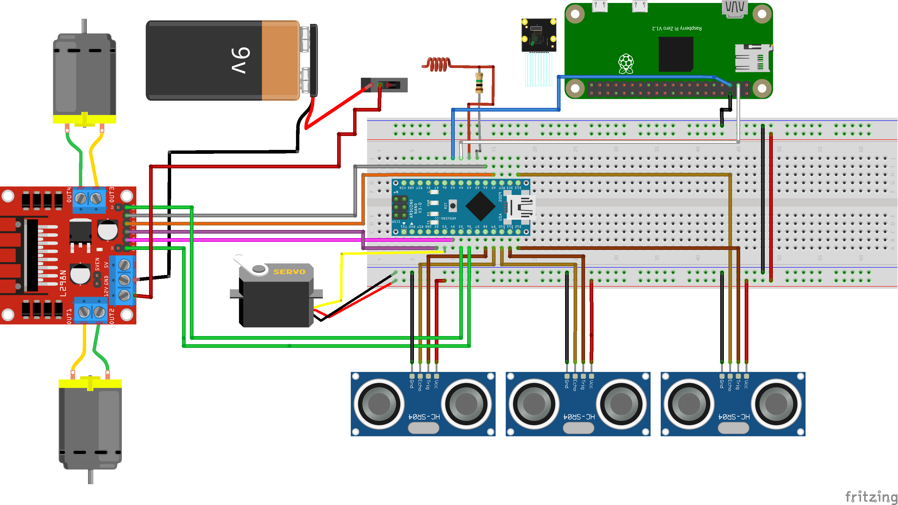

# CatScape
Robot autònom amb 3 rodes que amb 3 sensors de proximitat i una càmera és capaç de detectar un gat i allunyar-se'n sense xocar-se amb els obstacles
## taula de continguts
* [Descripció](#Descripció)
* [Requeriments](#Requeriments)
* [Contribucions sorprenents](#Contribucions_sorprenents)
* [Esquema maquinari](#Esquema_maquinari)
* [Peces 3D](#Peces_3D)
* [Arquitectura Programari](#Arquitectura_Programari)
* [Algorismes](#Algorismes)
* [Experiments realitzats](#Experiments_realitzats)
* [Autors](#Autors)

## Descripció
La joguina per gats CatEscape buscarà gats a la teva casa per tal de poder entretenir-los mitjançant una càmara i un algoritme de visió per computador. Quan detecti al gat començarà a escspar i a traves d'un plomissol cridarem la seva atenció. Quan consideri que el gat ha tocat el bot un número de vegades suficients o si ha seguit el robot un temps suficient, aquest deixarà anar pinso per tal de premiar al gat

El robot també comptara amb 3 sensors de proximitat per tal de poder esquivar els obstacles que trobi en el seu camí, i amb les rodes podrà girar sense cap problema cap a qualsevol direcció.

## Requeriments

## Contribucions sorprenents
* Proporciona entreteniment i activitat física: Els gats són animals actius per naturalesa i necessiten estimulació i exercici per mantenir-se sans i feliços.        CatScape proporciona una forma divertida i emocionant per als gats de jugar i mantenir-se actius, la qual cosa pot millorar el seu benestar general.
* Fomenta la interacció entre propietari i mascota: Jugar amb els gats és una excel·lent manera de desenvolupar i reforçar el llaç entre el propietari i la mascota. CatScape pot ser una eina per ajudar els propietaris a interactuar amb els seus gats i gaudir de moments divertits junts.
* Promou l'alimentació saludable: La funció de dispensar aliments de CatScape pot ser una forma útil per assegurar que els gats rebin la quantitat adequada d'aliment i que mengin més lentament, la qual cosa pot ser beneficiós per a la seva digestió.
* Serà probablement l'únic del curs que interactua amb un ésser que no és una persona, a la vegada que interactua amb l'entorn.
* Innovació en joguines per a mascotes: CatScape és una joguina innovadora que combina diverses funcions en un sol dispositiu, la qual cosa pot ser un avantatge competitiva en el mercat de joguines per a mascotes.
* Fomenta la creativitat: El disseny i la fabricació de CatScape requereixen habilitats i coneixements tècnics, la qual cosa ens permet fomentar la nostra creativitat i ampliar els nostres coneixements en el desenvolupament d'un robot apte per a mascotes.

## Esquema maquinari
3x Sensors de distància/ultrasò.
2x Rodes per moure el robot.
1x Raspberry pi zero.
1x Sensor capacitiu.
1x Controlador de motors.
1x Servomotor per la comporta del pinso.
1x Porta piles amb 6 piles.
1x Càmera 8 MB Raspberry PI.
2x Motor micro metall.
1x Roda de transferència.
1x Placa de proves. 

## Peces 3D

## Arquitectura Software

## Algorismes

## Experiments realitzats

## Autors

